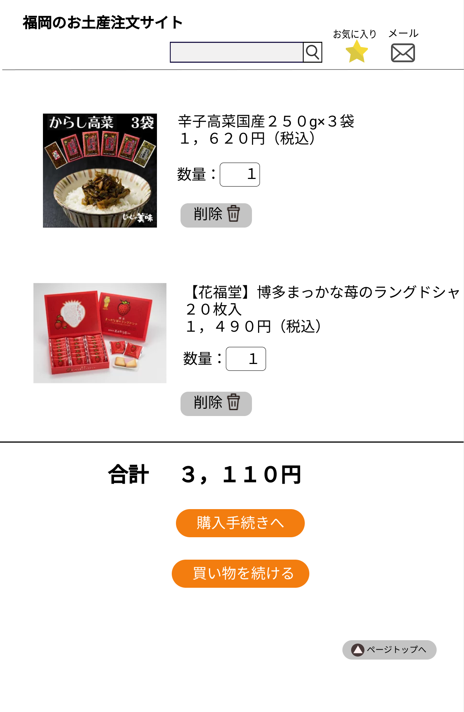

### 画面詳細図
## カートの中

[カートの中はこちらから](https://www.figma.com/file/Mxm4HVjnz1zAuFrfEpih3Z/カートの中?node-id=0%3A1)

*****

*****

|ID|要素|内容|アクション|イベント|対応DB|
|--|---|----|---------|-------|-------|
|1|サイト名|テキスト|サイト名を表示する|-|-|
|2|商品検索|テキスト画像|-|-|-|
|3|商品名|入力値|テキスト入力|-|-|
|4|検索|画像ボタン|クリック|検索処理実行|-|-|
|5|お気に入りボタン|画像ボタン|クリック|お気に入りの商品に遷移|-|
|6|お気に入り|テキスト表示|-|-|-|
|7|メールボタン|画像ボタン|クリック|メールに遷移|-|
|8|メール|テキスト表示|-|-|-|
|9|商品|商品画像、商品説明を表示|クリック|商品詳細に遷移|-|
|10|数量|入力値|テキスト入力|-|-|
|11|削除ボタン|テキストボタン|クリック|商品をカートから削除|-|
|12|購入手続きへ|テキストボタン|クリック|購入画面に遷移|-|
|13|買い物を続ける|テキストボタン|クリック|商品一覧へ遷移する|-|
|14|トップページへ|テキストボタン|クリック|ページの一番上に移動する|-|
