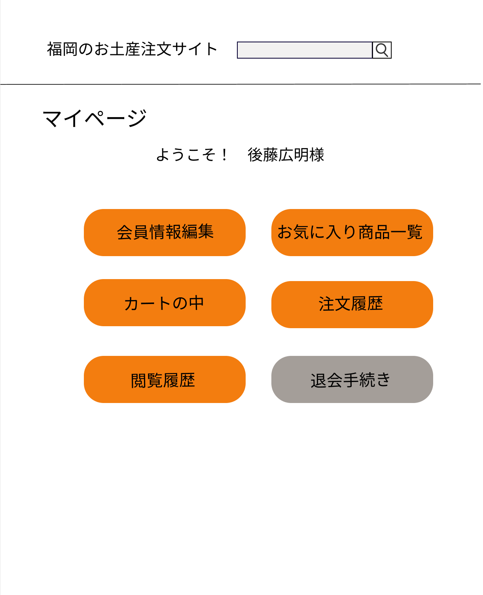

### 画面詳細図
## マイページ
[マイページはこちらから](https://www.figma.com/file/zomHM55jn3abpiHfkwk7FU/マイページ?node-id=0%3A1)
****

****
| ID | 要素 | 内容 | アクション | イベント | 対応DB |
|----|------|------|------------|----------|--------|
|1   |バナー|サイト名表示|-      |-          |-        |
|2   |商品検索|入力値|テキスト入力|-　　　　|○　　　　|
|3   |検索ボタン|ボタン|クリック|検索処理実行|○　　　 |
|4   |マイページ|ページ名表示|-      |-          |-        |
|5   |あいさつ|テキスト表示|- 　　　　|登録した名前によって名前の部分が変化|○|
|6   |お気に入り一覧|ボタン|クリック|お気に入りへ遷移|○|
|7   |カートの中|ボタン|クリック|カートの中へ遷移|○|
|8  |メール|ボタン|クリック|メール一覧へ遷移|○|
|9  |閲覧履歴|ボタン|クリック|閲覧履歴へ遷移|○|
|10  |購入履歴|ボタン|クリック|購入履歴へ遷移|○|
|11  |退会手続き|ボタン|クリック|退会手続き画面へ遷移|○|

