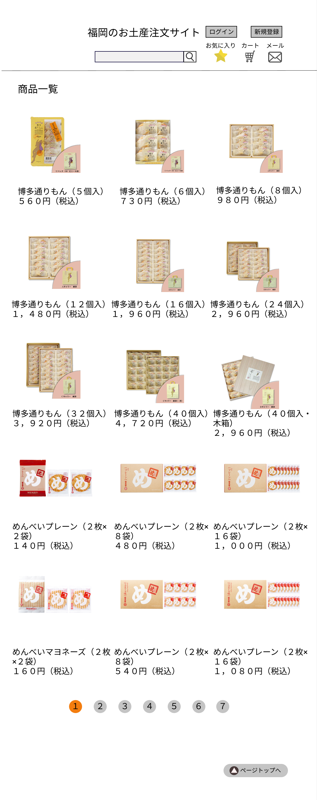

### 画面詳細図
## 商品一覧
[商品一覧はこちらから](https://www.figma.com/file/RYqtOfPBsoZrLrkSl6OKC6/商品一覧?node-id=0%3A1)
****

****
| ID | 要素 | 内容 | アクション | イベント | 対応DB |
|----|------|------|------------|----------|--------|
|1   |バナー|サイト名表示|-      |-          |-        |
|2   |ログインボタン|ボタン|クリック|ログイン画面へ遷移||
|3   |新規登録ボタン|ボタン|クリック|情報登録画面へ遷移||
|4   |商品検索|入力値|テキスト入力|-　　　　|○　　　　|
|5   |検索ボタン|ボタン|クリック|検索処理実行|○　　　|
|6   |お気に入り|テキスト表示|-　　|-　　　　|-　　　　|
|7   |お気に入りボタン|ボタン|クリック|お気に入りへ遷移|○|
|8   |カート|テキスト表示| -     |-          | -       |
|9   |カートボタン|ボタン|クリック|カートの中へ遷移|○|
|10  |メール|テキスト表示| -     | -         |-        |
|11  |メールボタン|ボタン|クリック|メール一覧へ遷移|○|
|12  |お気に入り|テキスト表示|-　　|-　　　　|-　　　　|
|13  |商品画像|画像表示|-　　　|-　　　　|-　　　　|
|14  |商品名|テキストリンク|クリック|商品詳細へ遷移|○|
|15  |カートに入れるボタン|ボタン|クリック|カートに商品が追加される|○|
|16  |削除ボタン|ボタン|クリック|お気に入りから削除される|○|
|17  |ページ切り替え|ボタン|クリック|次のページを表示|○|
|18  |トップページへ|テキストボタン|クリック|ページの一番上に移動|-|
