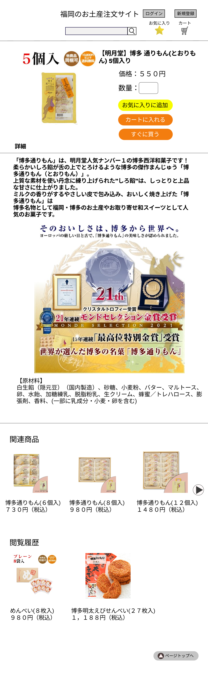

### 画面詳細図
## 商品詳細

[商品詳細はこちらから](https://www.figma.com/file/grKrUtxQjCbLWnXJSkVPp9/商品詳細?node-id=0%3A1)

*****

*****

|ID|要素|内容|アクション|イベント|対応DB|
|--|---|----|---------|-------|-------|
|1|サイト名|サイト名の表示|-|-|-|
|2|ログイン|ログインボタン|クリック|ログイン画面に遷移|-|
|3|新規登録|登録ボタン|クリック|新規登録画面に遷移|-|
|4|商品検索|テキスト画像|-|-|-|
|5|商品名|入力値|テキスト入力|-|-|
|6|検索|画像ボタン|クリック|検索処理実行|-|○|
|7|お気に入りボタン|画像ボタン|クリック|お気に入りの商品に遷移|○|
|8|お気に入り|テキスト表示|-|-|-|
|9|カートボタン|画像ボタン|クリック|カート内に遷移|○|
|10|カート|テキスト表示|-|-|-|
|11|メールボタン|画像ボタン|クリック|メール一覧に遷移|○|
|12|メール|テキスト表示|-|-|-|
|13|商品名|テキスト表示|-|-|-|
|14|商品画像|商品画像を表示|-|-|-|
|15|数量|入力値|テキスト入力|-|-|
|16|お気に入りに追加|ボタン|クリック|お気に入り商品に追加|○|
|17|カートに入れる|ボタン|クリック|カートに追加|○|
|18|すぐに買う|ボタン|クリック|購入手続きに遷移|○|
|19|商品詳細|商品説明、原材料を表示|-|-|-|
|20|関連商品|関連のある商品の画像、商品名を表示|クリック|商品詳細へ遷移|○|
|21|トップページへ|テキストボタン|クリック|ページの一番上に移動|-|
