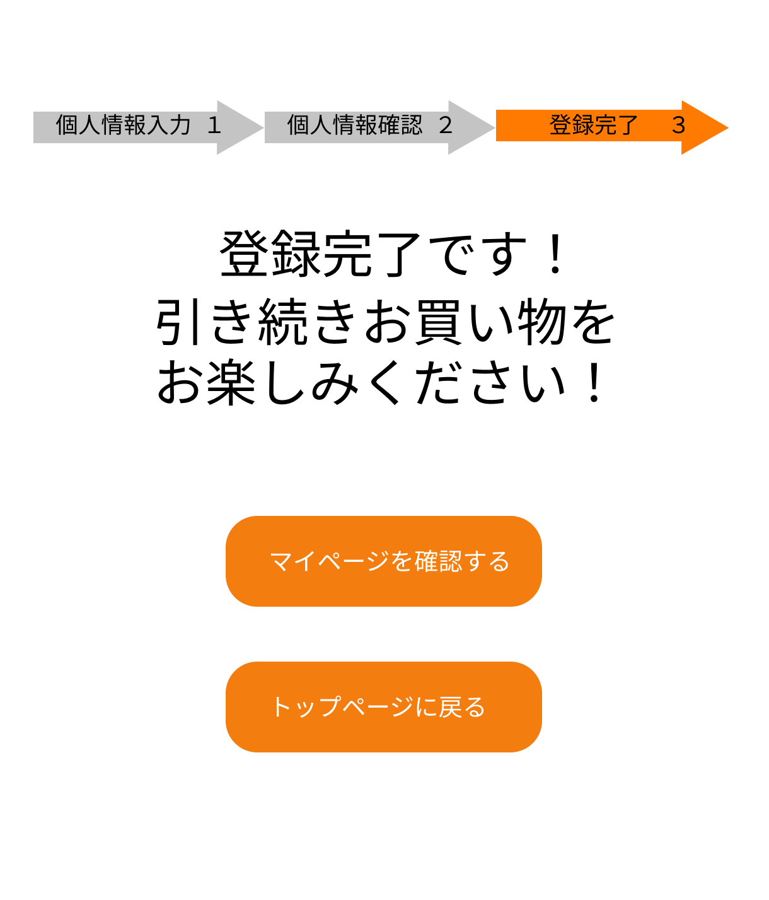

### 画面詳細図
## 登録完了
[登録完了はこちらから](https://www.figma.com/file/rUvTDFi7dW0gLsiQyKt4eX/登録完了?node-id=0%3A1)
****

****
| ID | 要素 | 内容 | アクション | イベント | 対応DB |
|----|------|------|------------|----------|--------|
|1   |バナー|ページ名表示|-      |-          |-        |
|2   |個人情報入力|テキストアイコン|-        |-      |-|
|3   |個人情報確認|テキストアイコン|-        |-      |-|
|4   |登録完了|テキストアイコン|-        　　|-      |-|
|5   |登録完了です|テキスト|-      |-　　　　|-  　　　|
|6   |マイページを確認|ボタン|クリック|マイページへ遷移|○|
|7   |トップページに戻る|ボタン|クリック|トップページへ遷移|○|

