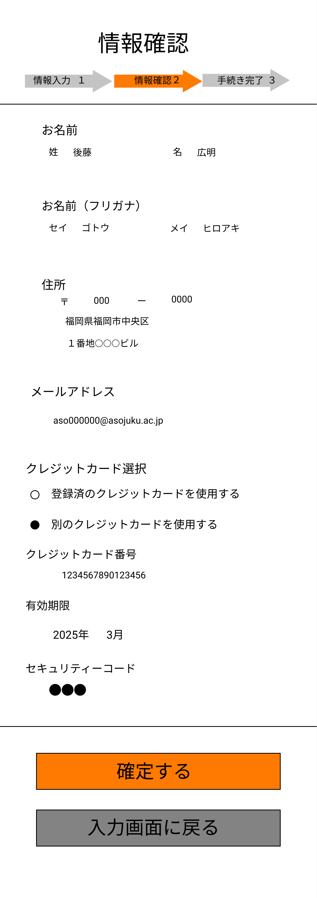

### 画面詳細図
## 確認画面（購入）
[確認画面（購入）はこちらから](https://www.figma.com/file/AcqvTd2ESv7CHI1u9nvaJY/確認画面?node-id=0%3A1)
****

****
| ID | 要素 | 内容 | アクション | イベント | 対応DB |
|----|------|------|------------|----------|--------|
|1   |バナー|ページ名表示|-      |-          |-      |
|2   |情報入力|テキストアイコン|-        |-      |-|
|3   |情報確認|テキストアイコン|-        |-      |-|
|4   |手続き完了|テキストアイコン|-        　　|-      |-|
|5   |お名前|テキスト|-        |-      　　　|-　　　|
|6   |氏名|テキスト|-           |-           |-       |
|7   |名前|テキスト|-            |-        |-        |
|8   |お名前(フリガナ)|テキスト|-        |-  　　　|-　　　|
|9   |氏名(フリガナ)|テキスト|-           |-      |-      |
|10  |名前(フリガナ)|テキスト|-           |-        |-  |
|11  |住所|テキスト表示|-　　|-　　　　|-　   　　　|
|12  |郵便番号|テキスト|-            |-     |-         |
|13  |都道府県|テキスト|-             |-       |       |
|14  |住所|テキスト|-              | -  -       |       |
|14  |住所|テキスト|-              | -         |-        |
|15  |番地・ビル名|テキスト|-       | -         |-        |
|16  |メールアドレス|テキスト|-　　　|-　　　　|-　　　　|
|17  |メールアドレス|テキスト|-        |-    |-     |
|18  |メールアドレス(確認用)|テキスト|-       |-    |-     |
|19  |クレジットカード選択|テキスト|-　　　|-　　　　|-　　　　|
|20  |○登録済のクレジットカードを使用する|テキスト|-       |購入手続きで選ばれた方のチェックリストを黒くする    |-     |
|21  |●別のクレジットカードを使用する|テキスト|-      | 購入手続きで選ばれた方のチェックリストを黒くする   |-     |
|22  |クレジットカード番号|テキスト|-　　　|-　　　　|-　　　　|
|23  |クレジットカード番号（入力）|テキスト|-      |-         |-         |
|24  |有効期限|テキスト|-       |-         |-       |
|25  |２０２５年|テキスト|-       |-          |-        |
|26  |３月|テキスト|-                |-       |-      |
|27  |セキュリティーコード|テキスト|-      |-         |-         |
|28  |セキュリティーコード（入力）|テキスト|-      |セキュリティーコードは隠す         |-         |
|29  |確定する|テキストボタン|クリック|購入完了へ遷移|○|
|30  |入力画面に戻る|テキストボタン|クリック|購入手続きへ遷移|○|
