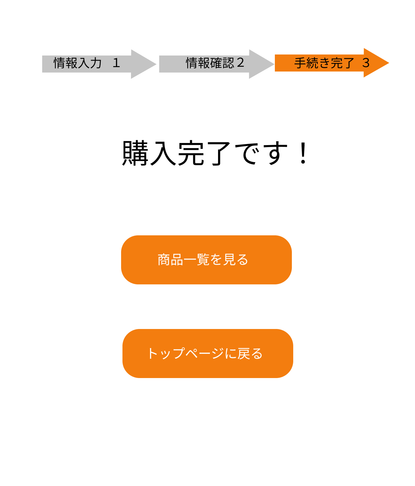

### 画面詳細図
## 購入完了
[購入完了はこちらから](https://www.figma.com/file/ZXMY2ZlPoQdxWIFpIQPPBM/購入完了?node-id=0%3A1)
****

****
| ID | 要素 | 内容 | アクション | イベント | 対応DB |
|----|------|------|------------|----------|--------|
|1   |情報入力|テキストアイコン|-        |-      |-|
|2   |情報確認|テキストアイコン|-        |-      |-|
|3   |手続き完了|テキストアイコン|-        　　|-      |-|
|4   |購入完了です！|テキスト|-      |-　　　　|-  　　　|
|5   |商品一覧を見る|ボタン|クリック|マイページへ遷移|○|
|6   |トップページに戻る|ボタン|クリック|トップページへ遷移|○|
