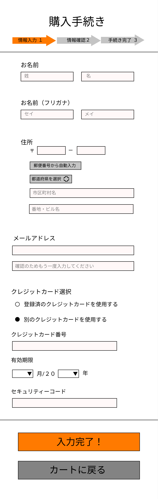

### 画面詳細図
## 購入手続き
[購入手続きはこちらから](https://www.figma.com/file/IJc3PbVAxiKaZIyg0KVQO9/購入手続き?node-id=0%3A1)
****

****
| ID | 要素 | 内容 | アクション | イベント | 対応DB |
|----|------|------|------------|----------|--------|
|1   |バナー|ページ名表示|-      |-          |-      |
|2   |情報入力|テキストアイコン|-        |-      |-|
|3   |情報確認|テキストアイコン|-        |-      |-|
|4   |手続き完了|テキストアイコン|-        　　|-      |-|
|5   |お名前|テキスト|-        |-      　　　|-　　　|
|6   |氏名|テキスト|-           |-           |-       |
|7  |氏名入力|テキスト|ボックステキスト入力|氏名を入力する  |-       |
|8   |名前|テキスト|-            |-        |-        |
|9   |名前入力|テキストボックス|テキスト入力|名前を入力する  |-       |
|10   |氏名(フリガナ)|テキスト|-           |-      |-      |
|11  |氏名（フリガナ）入力|テキストボックス|テキスト入力|氏名（フリガナ）を入力する  |-       |
|12  |名前(フリガナ)|テキスト|-        |-  　　　|-　　　|
|13   |名前（フリガナ）入力|テキストボックス|テキスト入力|名前（フリガナ）を入力する  |-       |
|14  |住所|テキスト表示|-　　|-　　　　|-　   　　　|
|15  |郵便番号|テキスト|-            |-     |-         |
|16  |郵便番号入力|テキストボックス|テキスト入力|郵便番号を入力する  |-       |
|17  |郵便番号から自動入力|テキストボタン|クリック|郵便番号が入力されていると住所が自動入力される  |○      |
|18  |都道府県を選択|リストメニュー |クリック|４７都道府県から１つ選択する|○|
|19  |住所|テキスト|-              | -  -       |       |
|20  |住所入力|テキストボックス|テキスト入力 |住所を入力する|-        |
|21  |番地・ビル名|テキスト|-       | -         |-        |
|22  |番地・ビル名入力|テキストボックス|テキスト入力|番地、ビル名を入力する|-        |
|23  |メールアドレス|テキスト|-　　　|-　　　　|-　　　　|
|24  |メールアドレス入力|テキストボックス|テキスト入力|メールアドレスを入力する|-     |
|25  |メールアドレス(確認用)|テキスト|-       |-    |-     |
|26  |メールアドレス(確認用)入力|テキストボックス|テキスト入力|メールアドレス（確認用）を入力する|-     |
|27  |クレジットカード選択|テキスト|-　　　|-　　　　|-　　　　|
|28  |登録済のクレジットカードを使用する|テキスト|-       |-    |-     |
|29  |○|ラジオボタン|クリック   |支払い時に事前に登録されたクレジットカード情報が使用される    |-     |
|30  |別のクレジットカードを使用する|テキスト|-      | 購入手続きで選ばれた方のチェックリストを黒くする   |-     |
|31  |●|ラジオボタン|クリック   |選択するとクレジットカード番号入力、有効期限入力、セキュリティーコード入力が表示される    |-     |
|32  |クレジットカード番号|テキスト|-　　　|-　　　　|-　　　　|
|33  |クレジットカード番号（入力）|テキストボックス|テキスト入力  | １６桁のクレジットカード番号を入力する  |-         |
|34  |有効期限|テキスト|-       |-         |-       |
|35  |月を選択|リストメニュー |クリック|１月から１２月の中から１つ選択する|○|
|36  |月/２０|テキスト|-       |-          |-        |
|37  |年を選択|リストメニュー |クリック|２１から３０年の中から１つ選択する|○|
|38  |年|テキスト|-                |-       |-      |
|39  |セキュリティーコード|テキスト|-      |-         |-         |
|40  |セキュリティーコード入力|テキストボックス|数値入力|３～４桁で表示は黒丸で隠す         |-         |
|41  |入力完了！|テキストボタン|クリック|確認画面（購入）へ遷移|○|
|42  |カートに戻る|テキストボタン|クリック|カートの中へ遷移|○|
